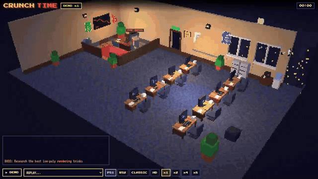
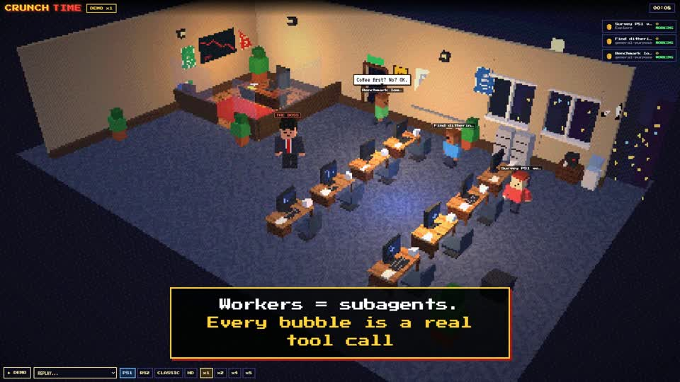
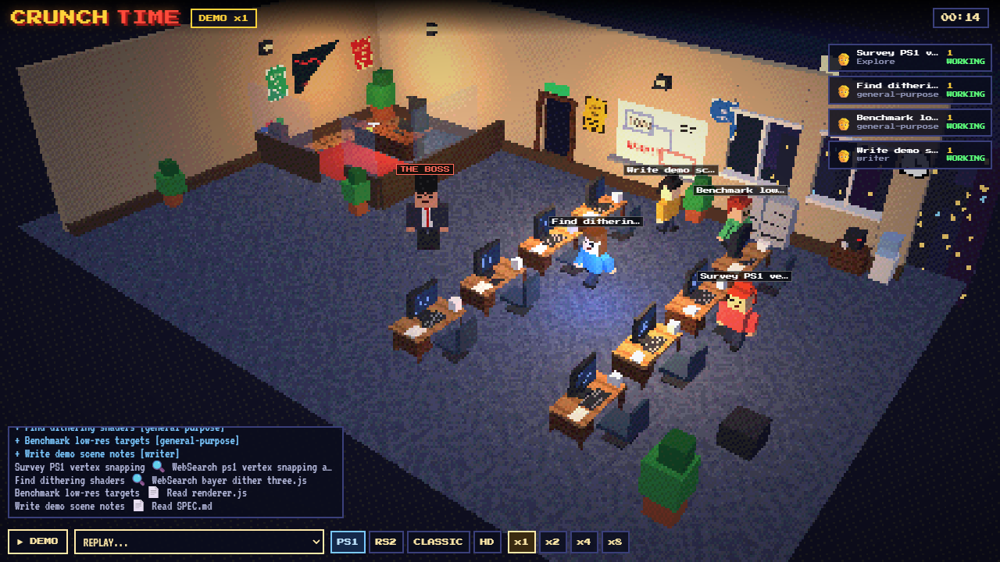
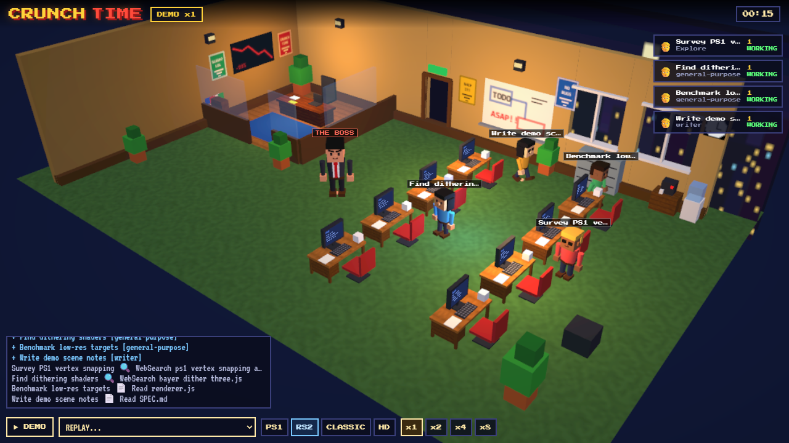
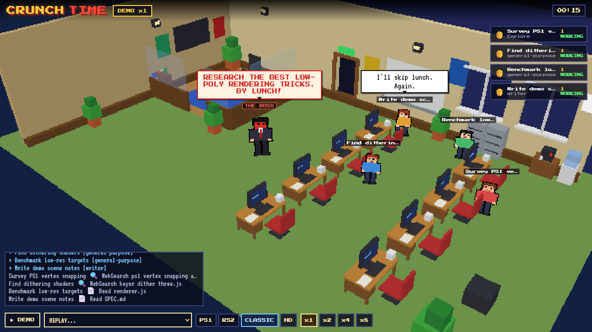
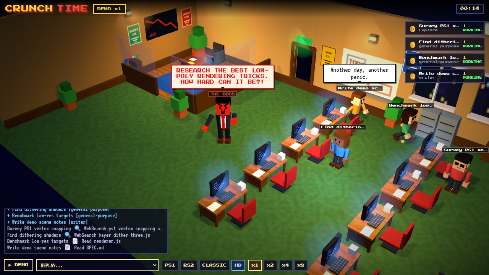
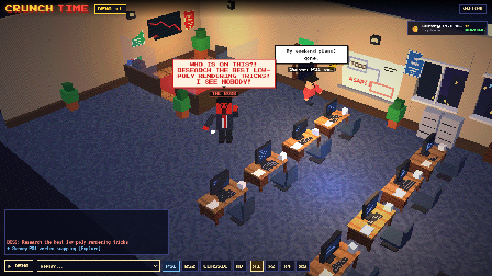
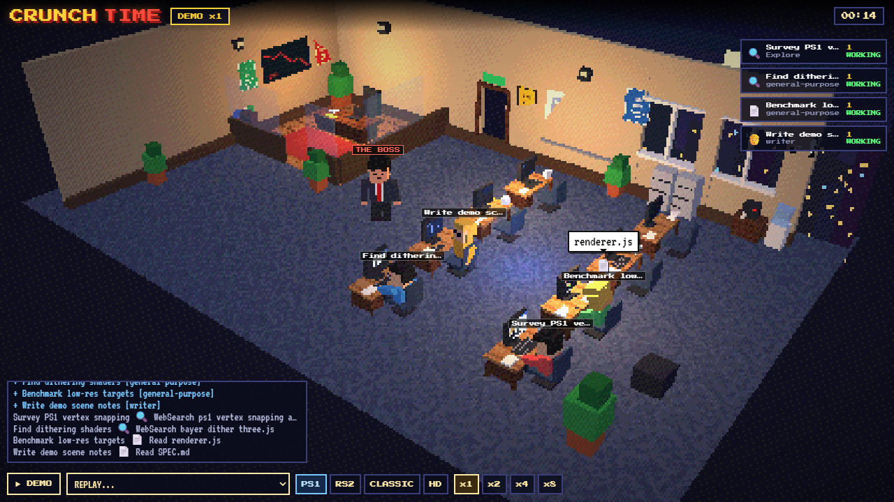
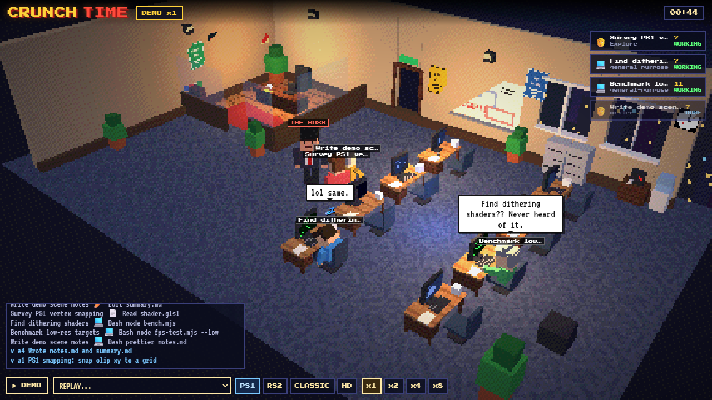

<p align="center">
  
</p>

<p align="center">
  <a href="media/promo.mp4"></a><br>
  <a href="media/promo.mp4"><b>▶ Watch the promo</b></a> (33 s) · <a href="media/promo-square.mp4">square version</a> · <a href="media/hero.mp4">raw clip</a> (20 s)
</p>

<h1 align="center">CRUNCH TIME</h1>

<p align="center"><b>Watch your Claude Code agents work as a low-poly PS1 office. The boss yells. The workers type. Nobody sleeps.</b></p>

<p align="center">
  <a href="LICENSE"></a>
  
  
  
  
  <a href="https://winchxyz.github.io/crunch-time/"></a>
</p>

**[Live demo](https://winchxyz.github.io/crunch-time/)** - opens in your browser and autoplays a scripted run. No install.

## What you're looking at

Every multi-agent Claude Code session is really an office. CRUNCH TIME just makes it visible.

- **The boss** is your main session. He storms in and yells your prompt.
- **The workers** are subagents. Each one gets a desk, a name tag and a task.
- **Tool calls become office actions.** What the agent really did is what you see.
- **Reports go back to the boss** when a subagent finishes.

| Tool call | What happens in the office |
|---|---|
| `WebSearch` | Worker opens a browser at their desk, the search query pops up |
| `WebFetch` | Worker browses a page, the hostname shows in a speech bubble |
| `Read` | Worker reads a file at the desk (basename in the bubble) |
| `Edit` / `Write` / `MultiEdit` | Worker types code, sparks fly |
| `Bash` | Worker works a terminal, the command description shows |
| `Grep` / `Glob` | Worker gets up and walks to the filing cabinet |
| anything else | Generic busy typing |

## Quick start

```bash
git clone https://github.com/winchxyz/crunch-time.git
cd crunch-time
npm start          # serves http://localhost:7777
npm run hooks      # installs the Claude Code hooks (user-level settings.json)
```

Open <http://localhost:7777>, then run any multi-agent task in Claude Code. Hooks are picked up by new sessions, so start a fresh one. No `npm install` needed: there are no dependencies and no build step.

Already have finished sessions? Pick one from the **REPLAY** dropdown and watch it back.

## How it works

```
 Claude Code hooks                                  your browser
 (PreToolUse, SubagentStart, ...)                   (Three.js, low-poly)
        |                                                 ^
        v                                                 |
   hook/emit.mjs  --POST /event-->  server.mjs  --SSE /stream-->  director
   (stdin JSON,                    normalize to                   (queues events,
    never fails)                   flat events                    walks the workers)
                                        |
                                        +--> data/raw.jsonl   (raw payloads, local)
```

1. Claude Code fires a hook. `hook/emit.mjs` forwards the payload to `localhost:7777` and always exits quietly, so it can never slow down or break a session.
2. `server.mjs` normalizes payloads into six flat event kinds (`boss_prompt`, `boss_tool`, `agent_spawn`, `agent_tool`, `agent_done`, `boss_idle`) and streams them over Server-Sent Events.
3. The browser feeds events into a director that turns them into walking, typing and yelling.
4. **Replay:** the server can also parse any past transcript from `~/.claude/projects` into the same events, so old runs play back like live ones.

It costs **zero tokens**. It never calls a model; it only watches events that already happened.

## Styles

Same events, different office. Switch with `?style=<name>`.

Pick one with the buttons at the bottom of the app, or load it directly with `?style=ps1|rs2|classic|hd`.

<table>
  <tr>
    <td align="center"><br><b>PS1 (default)</b></td>
    <td align="center"><br><b>RS2</b></td>
  </tr>
  <tr>
    <td align="center"><br><b>CLASSIC</b></td>
    <td align="center"><br><b>HD</b></td>
  </tr>
</table>

## Controls

- **Drag** to rotate the camera. The camera stays where you put it.
- **Mouse wheel** or **pinch** to zoom.
- **x1 / x2 / x4 / x8** buttons change the playback speed.
- **DEMO** replays the scripted demo, **REPLAY...** loads a past session, **PS1 / RS2 / CLASSIC / HD** switch the look.

## Screenshots

<table>
  <tr>
    <td></td>
    <td></td>
    <td></td>
  </tr>
  <tr>
    <td align="center">The boss yells</td>
    <td align="center">Everyone is busy</td>
    <td align="center">Report to the boss</td>
  </tr>
</table>

## Uninstall

```bash
npm run unhooks    # removes only the CRUNCH TIME hooks, leaves the rest of your settings
```

Every change to `settings.json` writes a `settings.json.bak-<timestamp>` backup next to it first.

## Privacy

Everything stays on localhost. The server binds to `127.0.0.1`, and nothing is sent anywhere else. The one CDN request is the Three.js library. Raw hook payloads (including your prompts and tool inputs) are appended to `data/raw.jsonl` on your machine; that folder is git-ignored, and you can delete it any time.

## FAQ

**Do the workers really talk?**
No. The chatter is generated from their real tool calls. If a worker says it is reading `renderer.js`, it really did.

**Does it slow down Claude Code?**
No. The hook has a 400 ms timeout, ignores every error and prints nothing.

**Can I use it without the hooks?**
Yes. Hit the demo button, or replay a past session from the dropdown.

**Can I make the README media?**
`npm run record -- --styles ps1,rs2,classic,hd` drives a headless browser on its own spare port and writes `media/` (needs `playwright-core` and `ffmpeg`).

## License

[MIT](LICENSE) (c) 2026 winchxyz
